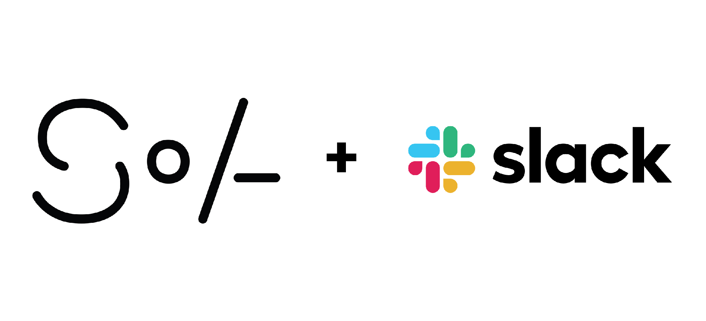

Slack is a community-oriented massive chat platform that allows for collaboration and communication with unlimited channels.
[Join the SoA Slack community here!](https://join.slack.com/t/cmusoa/shared_invite/zt-dtplac0h-rQTK6fTxN7aulSxNSFbZwQ) 

---

**Standard Tips**

- Technical support is crowd sourced here.

- Works great with mobile devices because you can see the notifications.

- Channels can be requested / created for specific topics, organizations, and activities. 

- Great way to stay connected with the school community for non-course / non-FERPA protected content (see [Privacy Policy](https://slack.com/privacy-policy)).

