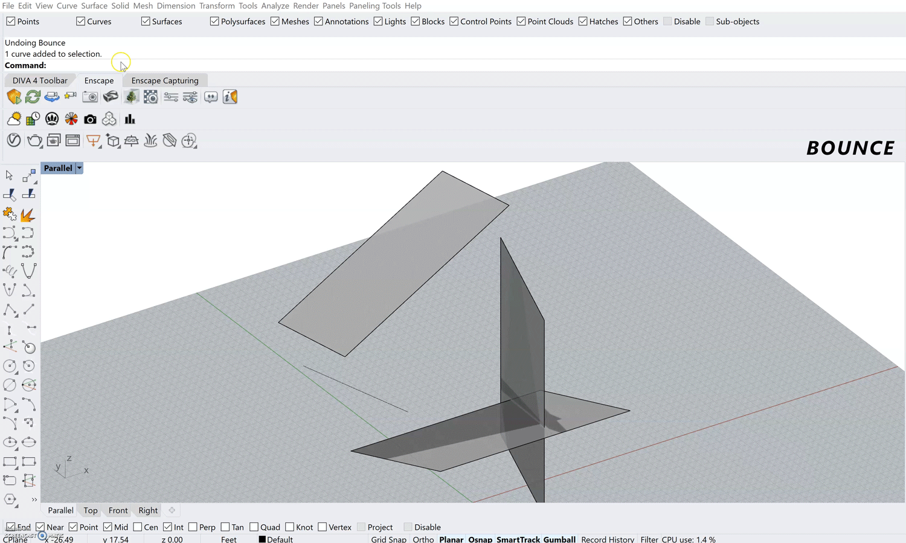

Rhino Tip: Bounce  

This command simulates bouncing off a set of surfaces and draws those bounces as a Polyline! Just select the surfaces you want to bounce off of and a vector by start and end points and it'll draw this bounce as a polyline!

