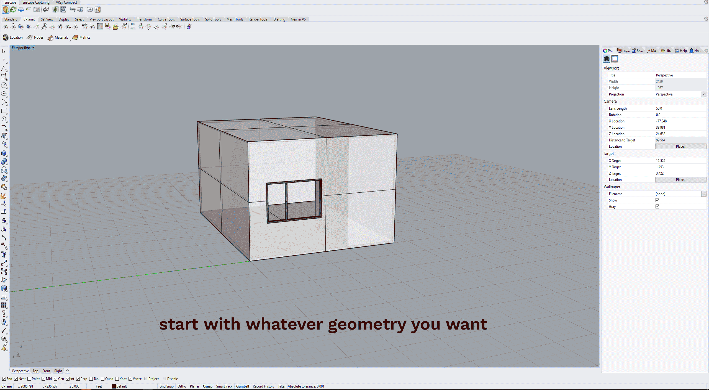

WORKFLOW TUTORIAL: Enscape to Photoshop Collage

This is a super fast rendering technique that gives you a lot of control over materials and lighting. I'm using a simple scene here for demonstration purposes, but using the object ID render channel makes it super easy for even complex scenes. Reach out to me if you have any questions, or want to see more images produced using this workflow! It's been my go-to this semester.
If you don't have Enscape you can download it for free [here.](https://enscape3d.com/educational-license/)

