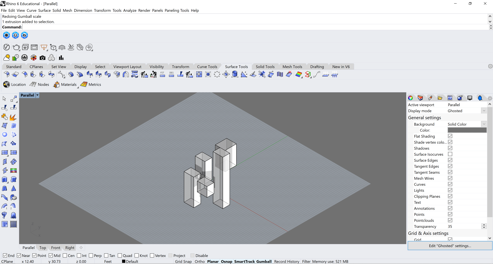

Quick Rhino Tip: Isolation

You might already know about this but the Isolate and Unisolate commands are really useful when working on a complex model and you want to work on specific parts and pieces on their own. Just select the objects you want to see on their own, and command Isolate. To return to the whole model, just command unisolate. Hope this is helpful!

