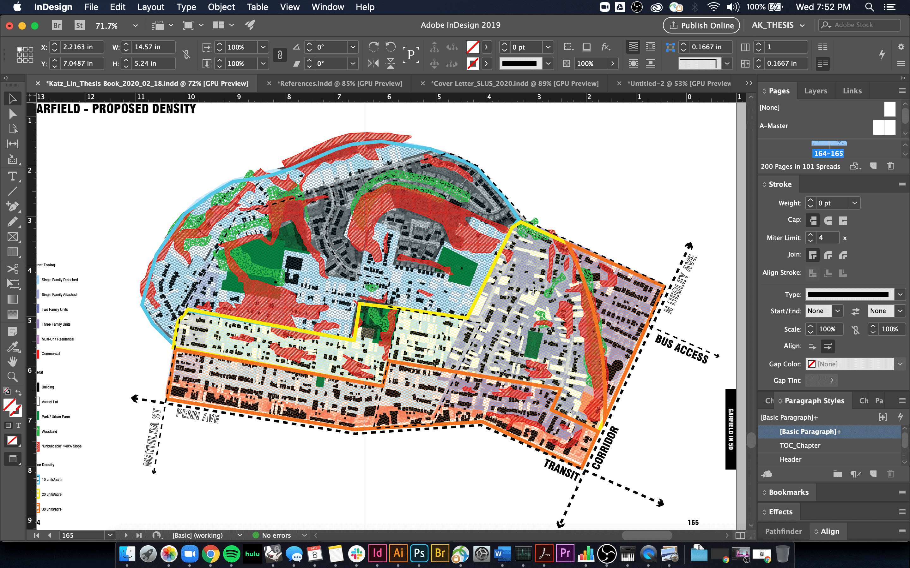

INDESIGN TIP: Tired of making multiple files or artboards in Illustrator or Photoshop for diagrams that are layering information? WELL.... you don't have to do that. Simply right click on a linked document in Indesign and then Click "Object Layer Options." You can override the layer settings in the orignal file here, simplifying the workflow.

